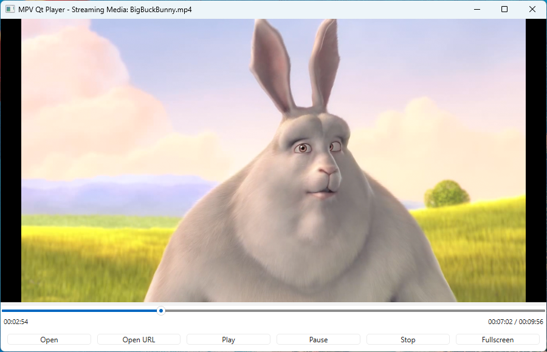
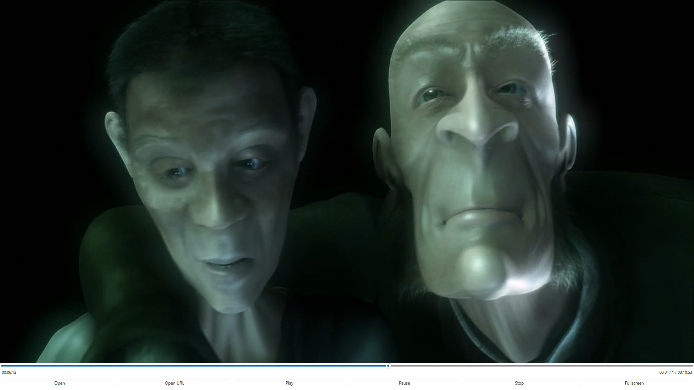

# PyQtMPVDemo Player

A video player built with PyQt6 and libmpv, featuring a clean GUI with fullscreen support, drag-and-drop file loading, streaming URL support, and keyboard controls. 

Single script file under 500 lines!

This was developed through vibe-coding from ChatGPT and Github Copilot (Claude Haiku 4.5 and Qwen3.5:397B cloud model via ollama). It's fun developing this while trying vibe coding.

Inspired from Qt-based [SMPlayer](https://www.smplayer.info/) and only problem I've is slow playback of 4k files. On my system, I've two graphics card: one discrete AMD and another Nvidia 5070 8GB. I'd to configure SMPlayer to force it play on Nvidia GPU for smooth playback of 4k and 8k files or streaming media. Therefore in the source you can find preference for Nvidia GPU.

*Note:* This repo is not tested cross platform though it contains multi-platform code. I will try and update when possible.

## Screenshots

<style>
figure {
  margin: 0 0 20px 0;
  text-align: center;
}
figure img {
  border: 2px solid #ddd;
  border-radius: 4px;
  max-width: 100%;
  height: auto;
}
figure figcaption {
  margin-top: 8px;
  font-style: italic;
  color: #666;
}
</style>

<figure>
  
  <figcaption><em>Main player window with controls and time display</em></figcaption>
</figure>

<hr>

<figure>
  
  <figcaption><em>Fullscreen mode with auto-hiding controls</em></figcaption>
</figure>

## Features

- **Multi-platform support**: Windows, macOS, and Linux
- **Video playback**: Local files and streaming URLs
- **Drag & drop**: Open media by dragging files onto the player
- **Fullscreen mode**: Immersive viewing experience with auto-hiding controls
- **Seeking**: Drag the slider or click to seek, arrow keys for quick seeking
- **Time display**: Current position with remaining and total time
- **Responsive UI**: Professional-looking footer with system colors
- **Cross-platform codec support**: Hardware acceleration for optimal performance

## Requirements

- Python 3.8 or higher
- PyQt6
- libmpv (system library)

## Installation

### 1. Clone the Repository

```bash
git clone <repository-url>
cd pyqtmpvdemo
```

### 2. Set Up Virtual Environment

#### Using `venv` (Python built-in):

```bash
# Create virtual environment
python -m venv venv

# Activate virtual environment
# On Windows:
venv\Scripts\activate

# On macOS/Linux:
source venv/bin/activate
```

#### Using `uv` (faster alternative):

```bash
# Install uv if not already installed
pip install uv

# Create virtual environment with uv
uv venv

# Activate virtual environment
# On Windows:
.venv\Scripts\activate

# On macOS/Linux:
source .venv/bin/activate
```

### 3. Install Dependencies

#### Using `pip`:

```bash
pip install -r requirements.txt
```

#### Using `uv`:

```bash
uv pip install -r requirements.txt
```

### 4. Install libmpv

The player requires libmpv (the system library for MPV) to be available. Here's how to install it on different platforms:

#### Windows

1. Download the latest libmpv build from the supported distributions([zhongfly/mpv-winbuild](https://github.com/zhongfly/mpv-winbuild/releases) OR [shinchiro/mpv-winbuild-cmake](https://github.com/shinchiro/mpv-winbuild-cmake/releases)) on the [official MPV website](https://mpv.io/installation/):
   - Look for releases with `libmpv` in the name (e.g., `mpv-dev-x86_64-<yyyymmdd>-git-<commit_id>.7z`)
   - *Sample build:* [mpv-dev-x86_64-20260325-git-793ab6d.7z](https://github.com/zhongfly/mpv-winbuild/releases/download/2026-03-25-eda0e0b/mpv-dev-x86_64-20260325-git-793ab6d.7z)
   
2. Extract the downloaded file

3. Add libmpv to your system PATH(Not recommended):
   - Copy `libmpv.dll` and `libmpv-2.dll` from the extracted folder
   - Navigate to `C:\Windows\System32` (or `C:\Windows\SysWOW64` for 32-bit)
   - Paste the DLL files there
   
   **Alternative**: Add the extraction folder to your system PATH:
   - Press `Win + X` and select "System"
   - Click "Advanced system settings"
   - Click "Environment Variables"
   - Under "System variables", click "New"
   - Variable name: `PATH`
   - Variable value: Path to the extracted libmpv folder
   - Click OK multiple times to save

*Note:* Can use `deps` directory on this repository for extracted library file. And append the directory to env:
```bat
C:\path\to\pyqtmpvdemo> set PATH=%PATH%;%CD%\deps
```

#### macOS

```bash
# Using Homebrew (recommended)
brew install mpv

# The library will be automatically available
```

#### Linux

```bash
# Ubuntu/Debian
sudo apt-get install libmpv1 libmpv-dev

# Fedora/RHEL
sudo dnf install mpv-libs mpv-libs-devel

# Arch
sudo pacman -S mpv
```

### 5. Run the Application

```bash
python demompv.py
```

## Usage

### Opening Media

- **File**: Click "Open" button or drag & drop media files onto the player
- **URL**: Click "Open URL" button and enter a streaming URL

#### Example Streaming URLs

You can test the player with these free streaming media URLs:

- **Big Buck Bunny** (720p, 9m 56s):
  ```
  http://commondatastorage.googleapis.com/gtv-videos-bucket/sample/BigBuckBunny.mp4
  ```

- **Elephant's Dream** (720p, 10m 53s):
  ```
  http://commondatastorage.googleapis.com/gtv-videos-bucket/sample/ElephantsDream.mp4
  ```

### Playback Controls

- **Play/Pause**: Use Play/Pause buttons or spacebar
- **Stop**: Click Stop button (resets slider to 0)
- **Seek**: 
  - Click anywhere on the slider to jump to that position
  - Drag the slider to scrub through the video
  - Left/Right arrow keys to seek ±5 seconds

### Fullscreen

- Click "Fullscreen" button or press F
- Controls auto-hide after 5 seconds of inactivity
- Move the mouse or click video to show controls
- Click video to toggle controls visibility

## Project Structure

```
pympvplayer/
├── demompv.py          # Main application file
├── requirements.txt    # Python dependencies
├── README.md           # This file
└── assets/             # Screenshot assets
    ├── screenshot-BigBuckBunny-windowed.png
    └── screenshot-ElephantDream-fullscreen.png
```

## Dependencies

- **PyQt6**: Modern GUI framework for Python
- **python-mpv**: Python bindings for libmpv

## Credits

This project uses the following excellent open-source projects:

- **[PyQt6](https://www.riverbankcomputing.com/software/pyqt/)** - Python bindings for the Qt framework (licensed under GPL v3)
- **[Qt Framework](https://www.qt.io/)** - Cross-platform application framework
- **[libmpv](https://github.com/mpv-player/mpv)** - Media playback library

Qt is a powerful cross-platform application development framework that provides native look and feel on all supported platforms. PyQt6 brings the full power of Qt to Python developers.

## License

This project is provided as-is for educational and personal use.

## Troubleshooting

### libmpv not found

If you get an error like "Could not find libmpv", ensure:
1. libmpv is properly installed on your system
2. It's added to the system PATH environment variable
3. Restart your terminal/IDE after adding to PATH

### Video won't play from URL

- Check your internet connection
- Ensure the URL is a valid streaming link
- Some streams may require additional codec support

### Hardware acceleration issues

If the player is using software rendering instead of GPU:
- Update your graphics drivers
- Check the application logs in `demompv.log` for details
- Try disabling hardware acceleration in the code (change `hwdec` parameter)

## Contributing

Feel free to fork this project and submit pull requests for any improvements.

## Contact

For questions or issues, please open an issue in the repository.
